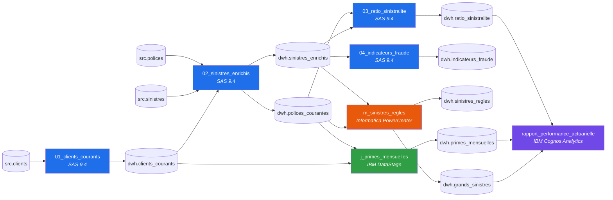

# Inventaire du parc legacy (multi-outils)

| Outil | Artefacts |
|---|---|
| SAS 9.4 | 4 |
| Informatica PowerCenter | 1 |
| IBM DataStage | 1 |
| IBM Cognos Analytics | 1 |

Effort de conversion indicatif : **11.0 jours-personne**. Sources externes : `src.clients`, `src.polices`, `src.sinistres`.

## Vagues de migration

Une vague ne dépend que des vagues précédentes (tri topologique à travers les outils).

1. `01_clients_courants`
2. `02_sinistres_enrichis`
3. `03_ratio_sinistralite`, `04_indicateurs_fraude`, `j_primes_mensuelles`, `m_sinistres_regles`
4. `rapport_performance_actuarielle`

## Artefacts

| Vague | Outil | Artefact | Type | Score | Complexité | Entrées | Sorties | Patron cible |
|---|---|---|---|---|---|---|---|---|
| 1 | SAS 9.4 | `01_clients_courants` | programme | 9 | Faible | src.clients | dwh.clients_courants | dbt (Databricks/Snowflake). SAS Viya : Compute : compatible (lift-and-shift); CAS : ajustements requis |
| 2 | SAS 9.4 | `02_sinistres_enrichis` | programme | 14 | Moyenne | src.polices, src.sinistres, dwh.clients_courants | dwh.polices_courantes, dwh.sinistres_enrichis | dbt (Databricks/Snowflake). SAS Viya : Compute : compatible (lift-and-shift); CAS : ajustements requis |
| 3 | IBM DataStage | `j_primes_mensuelles` | job parallèle | 22 | Moyenne | dwh.polices_courantes, dwh.clients_courants | dwh.primes_mensuelles | dbt : SELECT source + LEFT JOIN (lookup Continue) + GROUP BY; modèle incrémental sur la clé d'upsert; paramètres en var(); partitionnement laissé au moteur |
| 3 | Informatica PowerCenter | `m_sinistres_regles` | mapping | 18 | Moyenne | dwh.sinistres_enrichis, dwh.polices_courantes | dwh.sinistres_regles, dwh.grands_sinistres | dbt : un modèle par groupe du Router (incrémental, unique_key), expressions en CASE/COALESCE, lookups en LEFT JOIN; orchestration par Databricks Workflows / ADF à la place du workflow |
| 3 | SAS 9.4 | `03_ratio_sinistralite` | programme | 31 | Élevée | dwh.polices_courantes, dwh.sinistres_enrichis | dwh.ratio_sinistralite | dbt (Databricks/Snowflake). SAS Viya : Compute : compatible (lift-and-shift); CAS : ajustements requis |
| 3 | SAS 9.4 | `04_indicateurs_fraude` | programme | 13 | Moyenne | dwh.sinistres_enrichis | dwh.indicateurs_fraude | dbt (Databricks/Snowflake). SAS Viya : Compute : compatible (lift-and-shift); CAS : ajustements requis |
| 4 | IBM Cognos Analytics | `rapport_performance_actuarielle` | rapport | 14 | Moyenne | dwh.ratio_sinistralite, dwh.primes_mensuelles, dwh.grands_sinistres | - | Modèle sémantique (Power BI / dbt Semantic Layer / Databricks metric views) sur les marts gold; visuels reconstruits; mesures ratio = somme / somme |

## Constats par artefact (hors SAS, détaillé dans sas_inventory.md)

### Informatica PowerCenter — `m_sinistres_regles`

Sinistres réglés nets de franchise; aiguillage des grands sinistres vers la réassurance

Composants : Source Qualifier : SQ_SINISTRES_ENRICHIS; Lookup Procedure : LKP_POLICES_COURANTES; Expression : EXP_MONTANT_NET; Router : RTR_TAILLE_SINISTRE; Update Strategy : UPD_UPSERT; Workflow : wf_actuariat_nuit

| Code | Sévérité | Où | Constat | Recommandation |
|---|---|---|---|---|
| INFA-SQ-02 | faible | SQ_SINISTRES_ENRICHIS | Filtre source : SINISTRES_ENRICHIS.STATUT = 'FERME'. | Reporter le filtre dans le WHERE du modèle dbt. |
| INFA-LKP-01 | élevée | LKP_POLICES_COURANTES | Politique de correspondance multiple « Use Any Value » : résultat non déterministe si la clé n'est pas unique. | Tester l'unicité de la clé de recherche; sinon QUALIFY row_number() avec un tri explicite. |
| INFA-LKP-02 | moyenne | LKP_POLICES_COURANTES | Lookup connecté : une absence de correspondance renvoie NULL (jointure gauche implicite). | LEFT JOIN explicite et test de complétude sur la colonne ramenée. |
| INFA-FN-TO_CHAR | moyenne | EXP_MONTANT_NET.O_MOIS_SINISTRE | Fonction TO_CHAR : TO_CHAR(DATE_SINISTRE, 'YYYYMM') — Les masques de format diffèrent (YYYYMM vs %Y%m vs yyyyMM). | Équivalent : strftime / date_format / to_char selon la cible. |
| INFA-FN-DECODE | moyenne | EXP_MONTANT_NET.O_FRANCHISE | Fonction DECODE : DECODE(PRODUIT, 'AUTO', 500, 'HABITATION', 1000, 0) — DECODE compare aussi les NULL entre eux; CASE WHEN x = NULL ne le fait pas. | Équivalent : CASE WHEN ... THEN ... ELSE. |
| INFA-FN-IIF | moyenne | EXP_MONTANT_NET.O_MONTANT_NET | Fonction IIF : IIF(ISNULL(MONTANT_PAYE), 0, IIF(MONTANT_PAYE - O_FRANCHISE < 0, 0, MONTANT_PAYE - O_FRANCHISE)) — IIF imbriqués : réécrire en un seul CASE lisible. | Équivalent : CASE WHEN ... THEN ... ELSE ... END. |
| INFA-FN-ISNULL | faible | EXP_MONTANT_NET.O_MONTANT_NET | Fonction ISNULL : IIF(ISNULL(MONTANT_PAYE), 0, IIF(MONTANT_PAYE - O_FRANCHISE < 0, 0, MONTANT_PAYE - O_FRANCHISE)). | Équivalent : x IS NULL. |
| INFA-NUM-01 | moyenne | EXP_MONTANT_NET.O_RATIO_PRIME | Division dans O_RATIO_PRIME écrite dans une colonne de précision 12,6 : la base cible arrondit à l'écriture. | Reproduire l'arrondi explicitement : round(..., 6); garder nullif(x, 0). |
| INFA-RTR-01 | élevée | RTR_TAILLE_SINISTRE | Router à 2 groupes : une ligne qui satisfait un groupe n'est PAS envoyée au groupe par défaut. | Un modèle par groupe; le groupe par défaut = NOT (union des conditions des autres groupes). |
| INFA-UPD-01 | moyenne | UPD_UPSERT | Stratégie de mise à jour : DD_UPDATE. | Modèle incrémental dbt (merge / delete+insert) sur la clé primaire de la cible. |
| INFA-SES-01 | moyenne | s_m_sinistres_regles | Session en « Update else Insert » : upsert réalisé par le moteur, invisible dans le mapping. | MERGE / incrémental dbt avec unique_key; documenter la clé. |

### IBM DataStage — `j_primes_mensuelles`

Primes émises par mois d'émission, produit et segment client (hors polices annulées)

Composants : OracleConnectorPX : ORA_POLICES; OracleConnectorPX : ORA_CLIENTS; PxLookup : LKP_SEGMENT; CTransformerStage : TRF_DERIVATIONS; PxAggregator : AGG_MOIS_PRODUIT_SEGMENT; OracleConnectorPX : ORA_PRIMES_MENSUELLES

| Code | Sévérité | Où | Constat | Recommandation |
|---|---|---|---|---|
| DS-LKP-01 | élevée | LKP_SEGMENT | Échec de recherche = « Continue » : décide si les lignes sans correspondance sont gardées. | Équivalent : LEFT JOIN (colonnes nulles). |
| DS-PAR-01 | faible | LKP_SEGMENT | Partitionnement explicite « Entire ». | À supprimer : Spark/Snowflake répartissent seuls; surveiller l'asymétrie (skew) à la place. |
| DS-SV-01 | faible | TRF_DERIVATIONS.StageVar_EstNouveauProduit | Variable d'étape dépendante de la ligne précédente : calcul sensible à l'ordre et au partitionnement. Elle n'alimente aucune colonne (code mort). | Fonction de fenêtre (lag) avec tri explicite, ou suppression si code mort. |
| DS-FN-If | faible | TRF_DERIVATIONS.StageVar_EstNouveauProduit | If lnk_polices_segment.PRODUIT <> sv_ProduitPrecedent Then 1 Else 0. | Équivalent : CASE WHEN. |
| DS-FN-DateToString | moyenne | TRF_DERIVATIONS.MOIS_EMISSION | DateToString(lnk_polices_segment.DATE_DEBUT, "%yyyy%mm") — Masque %yyyy%mm propre à DataStage. | Équivalent : strftime / date_format. |
| DS-FN-Trim | moyenne | TRF_DERIVATIONS.PRODUIT | Trim(lnk_polices_segment.PRODUIT) — Trim DataStage réduit aussi les espaces internes multiples. | Équivalent : trim. |
| DS-FN-IsNull | faible | TRF_DERIVATIONS.SEGMENT | If IsNull(lnk_polices_segment.SEGMENT) Then "INCONNU" Else lnk_polices_segment.SEGMENT. | Équivalent : x is null. |
| DS-FN-If | faible | TRF_DERIVATIONS.SEGMENT | If IsNull(lnk_polices_segment.SEGMENT) Then "INCONNU" Else lnk_polices_segment.SEGMENT. | Équivalent : CASE WHEN. |
| DS-FN-NullToZero | faible | TRF_DERIVATIONS.PRIME | NullToZero(lnk_polices_segment.PRIME_ANNUELLE). | Équivalent : coalesce(x, 0). |
| DS-PAR-01 | faible | AGG_MOIS_PRODUIT_SEGMENT | Partitionnement explicite « Hash ». | À supprimer : Spark/Snowflake répartissent seuls; surveiller l'asymétrie (skew) à la place. |
| DS-TGT-01 | moyenne | ORA_PRIMES_MENSUELLES | Écriture en mode Upsert sur MOIS_EMISSION, PRODUIT, SEGMENT | Modèle incrémental dbt avec unique_key composite. |
| DS-PRM-01 | faible | paramètres | Paramètres de job : P_DATE_TRAITEMENT, P_SCHEMA_DWH. | Variables dbt (var()) ou paramètres de job Databricks. |

### IBM Cognos Analytics — `rapport_performance_actuarielle`

Composants : Requête : Q_Ratio; Requête : Q_Primes; Requête : Q_Grands_Sinistres; crosstab : Ratio par produit et annee; combinationChart : Primes par mois; list : Top 10 grands sinistres

| Code | Sévérité | Où | Constat | Recommandation |
|---|---|---|---|---|
| COG-AGG-01 | élevée | Q_Ratio.Ratio | Élément calculé « [Total paye] / [Primes acquises] » avec agrégat « calculated » : Cognos calcule le ratio APRÈS agrégation (ratio des sommes), pas la somme des ratios. | Mesure du modèle sémantique : DIVIDE(SUM(num), SUM(dén)) en Power BI, ratio metric dans la couche sémantique dbt ou metric view Databricks. |
| COG-PRM-01 | faible | Q_Ratio | Invites : p_annee_debut, p_annee_fin. | Paramètres ou segments (slicers) du rapport cible. |
| COG-AGG-02 | moyenne | Q_Primes.Prime moyenne | Moyenne d'une moyenne pré-calculée : biaisée si les groupes n'ont pas la même taille. | Exposer somme et nombre, calculer la moyenne pondérée dans la mesure. |
| COG-PRM-01 | faible | Q_Primes | Invites : p_annee_fin. | Paramètres ou segments (slicers) du rapport cible. |
| COG-FN-01 | moyenne | Q_Grands_Sinistres.Rang | Fonction de rang Cognos : rank([Montant net] for [Produit]). | rank() over (partition by ... order by ... desc); préciser le traitement des ex æquo. |

## Évaluation SAS Viya

| Programme | Serveur Compute (lift-and-shift) et CAS |
|---|---|
| `01_clients_courants` | Compute : compatible (lift-and-shift); CAS : ajustements requis CAS : DATA step multithread; BY/FIRST., RETAIN et LAG ne voient que les lignes du même fil. Exécuter avec single=yes ou garantir que chaque groupe BY est traité par un seul fil. CAS : PROC SORT est inutile (tables CAS non ordonnées); le BY du DATA step regroupe à la volée. Chemins de fichiers absolus (libname, %include) à remplacer par des caslibs ou des chemins du serveur Compute. |
| `02_sinistres_enrichis` | Compute : compatible (lift-and-shift); CAS : ajustements requis CAS : DATA step multithread; BY/FIRST., RETAIN et LAG ne voient que les lignes du même fil. Exécuter avec single=yes ou garantir que chaque groupe BY est traité par un seul fil. CAS : PROC SORT est inutile (tables CAS non ordonnées); le BY du DATA step regroupe à la volée. CAS : PROC SQL s'exécute sur le serveur Compute, pas dans CAS; passer à PROC FEDSQL pour CAS. Chemins de fichiers absolus (libname, %include) à remplacer par des caslibs ou des chemins du serveur Compute. |
| `03_ratio_sinistralite` | Compute : compatible (lift-and-shift); CAS : ajustements requis CAS : PROC SORT est inutile (tables CAS non ordonnées); le BY du DATA step regroupe à la volée. CAS : PROC SQL s'exécute sur le serveur Compute, pas dans CAS; passer à PROC FEDSQL pour CAS. CAS : remplacer PROC SUMMARY par PROC MDSUMMARY ou l'action simple.summary. CAS : MERGE exige un BY et ne garantit pas l'ordre des lignes en sortie. Chemins de fichiers absolus (libname, %include) à remplacer par des caslibs ou des chemins du serveur Compute. |
| `04_indicateurs_fraude` | Compute : compatible (lift-and-shift); CAS : ajustements requis CAS : DATA step multithread; BY/FIRST., RETAIN et LAG ne voient que les lignes du même fil. Exécuter avec single=yes ou garantir que chaque groupe BY est traité par un seul fil. CAS : PROC SORT est inutile (tables CAS non ordonnées); le BY du DATA step regroupe à la volée. Chemins de fichiers absolus (libname, %include) à remplacer par des caslibs ou des chemins du serveur Compute. |

## Lignage inter-outils

