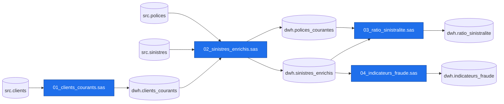

# Inventaire du parc SAS

- Programmes analysés : **5**
- Sources externes : `src.clients`, `src.polices`, `src.sinistres`
- Sorties finales : `dwh.indicateurs_fraude`, `dwh.ratio_sinistralite`
- Effort de conversion indicatif : **6.5 jours-personne**

## Programmes

| Ordre | Programme | Lignes | Étapes | Score | Complexité | Entrées | Sorties |
|---|---|---|---|---|---|---|---|
| 1 | `00_autoexec` | 6 | 0 | 0 | config | - | - |
| 2 | `01_clients_courants` | 22 | 3 | 9 | Faible | src.clients | dwh.clients_courants |
| 3 | `02_sinistres_enrichis` | 49 | 6 | 14 | Moyenne | src.polices, src.sinistres, dwh.clients_courants | dwh.polices_courantes, dwh.sinistres_enrichis |
| 4 | `03_ratio_sinistralite` | 45 | 6 | 31 | Élevée | dwh.polices_courantes, dwh.sinistres_enrichis | dwh.ratio_sinistralite |
| 5 | `04_indicateurs_fraude` | 25 | 2 | 13 | Moyenne | dwh.sinistres_enrichis | dwh.indicateurs_fraude |

## Pièges de migration détectés

| Programme | Ligne | Code | Sévérité | Constat | Recommandation |
|---|---|---|---|---|---|
| `01_clients_courants` | 17 | SAS-BY-01 | moyenne | Traitement BY avec FIRST./LAST. : dépend de l'ordre physique produit par PROC SORT. | ROW_NUMBER() OVER (PARTITION BY ... ORDER BY ...) avec QUALIFY, ordre de tri total et déterministe. |
| `01_clients_courants` | 25 | SAS-STR-01 | faible | Fonctions de chaîne SAS sans équivalent direct (PROPCASE, CATX, STRIP). | Macro dbt dédiée et tests sur les caractères accentués et les traits d'union. |
| `01_clients_courants` | 26 | SAS-DATE-01 | moyenne | INTCK('YEAR', ..., 'C') calcule des années révolues ; DATE_DIFF('year') compte les changements d'année. | Utiliser AGE() / date_part('year', age(...)) et tester les anniversaires. |
| `01_clients_courants` | 28 | SAS-MISS-01 | élevée | Comparaison « < » ou « <= » dans un IF : en SAS, une valeur manquante est inférieure à tout nombre, alors qu'en SQL NULL < n est inconnu (faux). | Rendre explicite le traitement des NULL (ex. `x is null or x < n`) puis valider la règle avec le métier. |
| `02_sinistres_enrichis` | 16 | SAS-BY-01 | moyenne | Traitement BY avec FIRST./LAST. : dépend de l'ordre physique produit par PROC SORT. | ROW_NUMBER() OVER (PARTITION BY ... ORDER BY ...) avec QUALIFY, ordre de tri total et déterministe. |
| `02_sinistres_enrichis` | 26 | SAS-BY-01 | moyenne | Traitement BY avec FIRST./LAST. : dépend de l'ordre physique produit par PROC SORT. | ROW_NUMBER() OVER (PARTITION BY ... ORDER BY ...) avec QUALIFY, ordre de tri total et déterministe. |
| `02_sinistres_enrichis` | 56 | SAS-MISS-01 | élevée | Comparaison « < » ou « <= » dans un IF : en SAS, une valeur manquante est inférieure à tout nombre, alors qu'en SQL NULL < n est inconnu (faux). | Rendre explicite le traitement des NULL (ex. `x is null or x < n`) puis valider la règle avec le métier. |
| `03_ratio_sinistralite` | 11 | SAS-SQL-01 | élevée | MIN()/MAX() à plusieurs arguments dans PROC SQL : fonctions ligne, pas des agrégats. | LEAST() / GREATEST(). |
| `03_ratio_sinistralite` | 29 | SAS-MAC-01 | moyenne | Boucle macro générant du code ou des tables à nom dynamique. | Boucle Jinja dans dbt, ou mieux, une table de paramètres jointe (range/generate_series). |
| `03_ratio_sinistralite` | 47 | SAS-MRG-01 | moyenne | MERGE avec IN= : jointure positionnelle, comportement particulier en plusieurs-à-plusieurs. | JOIN explicite (LEFT/INNER selon IN=) et test d'unicité des clés de chaque côté. |
| `04_indicateurs_fraude` | 19 | SAS-RET-01 | moyenne | RETAIN / instruction somme : accumulation ligne à ligne propre au DATA step. | SUM() / COUNT() OVER (PARTITION BY ... ORDER BY ... ROWS UNBOUNDED PRECEDING). |
| `04_indicateurs_fraude` | 21 | SAS-LAG-01 | élevée | LAG() est une file d'attente et non une fonction de fenêtre ; exécuté sous condition, il retourne des valeurs inattendues. | LAG() OVER (PARTITION BY ... ORDER BY ...) ; vérifier que l'appel SAS est inconditionnel. |
| `04_indicateurs_fraude` | 23 | SAS-BY-01 | moyenne | Traitement BY avec FIRST./LAST. : dépend de l'ordre physique produit par PROC SORT. | ROW_NUMBER() OVER (PARTITION BY ... ORDER BY ...) avec QUALIFY, ordre de tri total et déterministe. |
| `04_indicateurs_fraude` | 29 | SAS-RET-01 | moyenne | RETAIN / instruction somme : accumulation ligne à ligne propre au DATA step. | SUM() / COUNT() OVER (PARTITION BY ... ORDER BY ... ROWS UNBOUNDED PRECEDING). |

## Lignage

